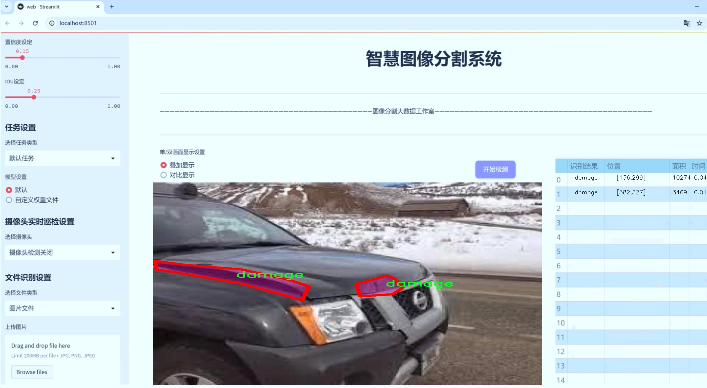
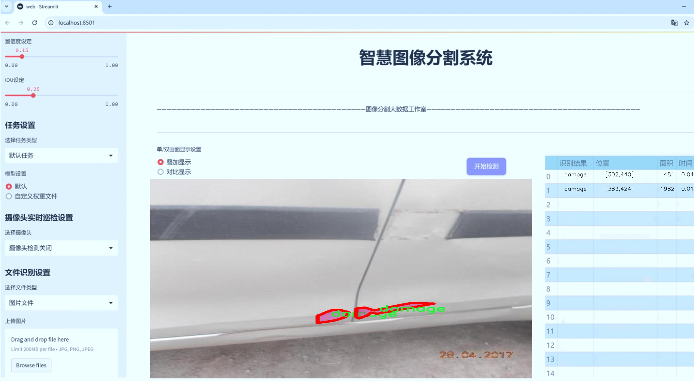
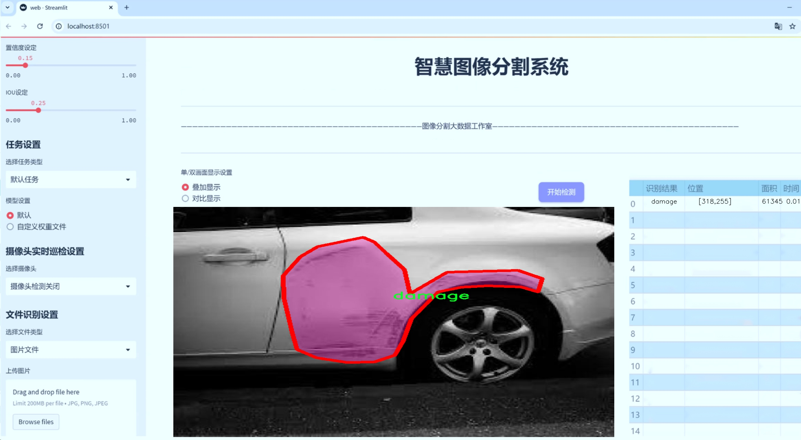
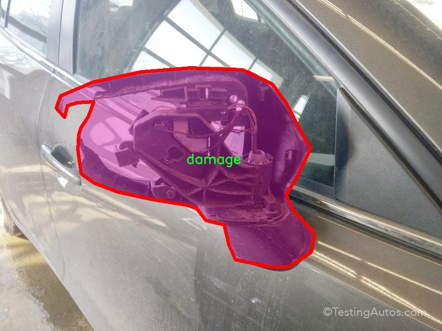
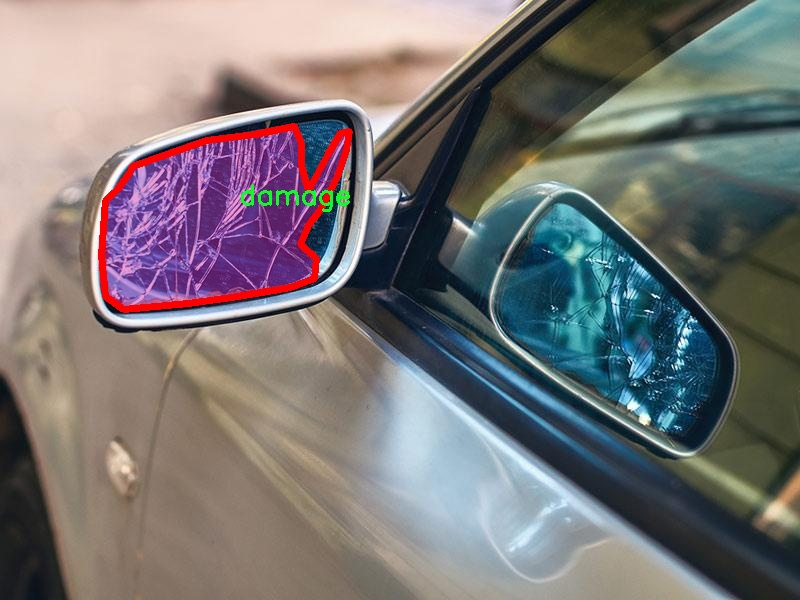
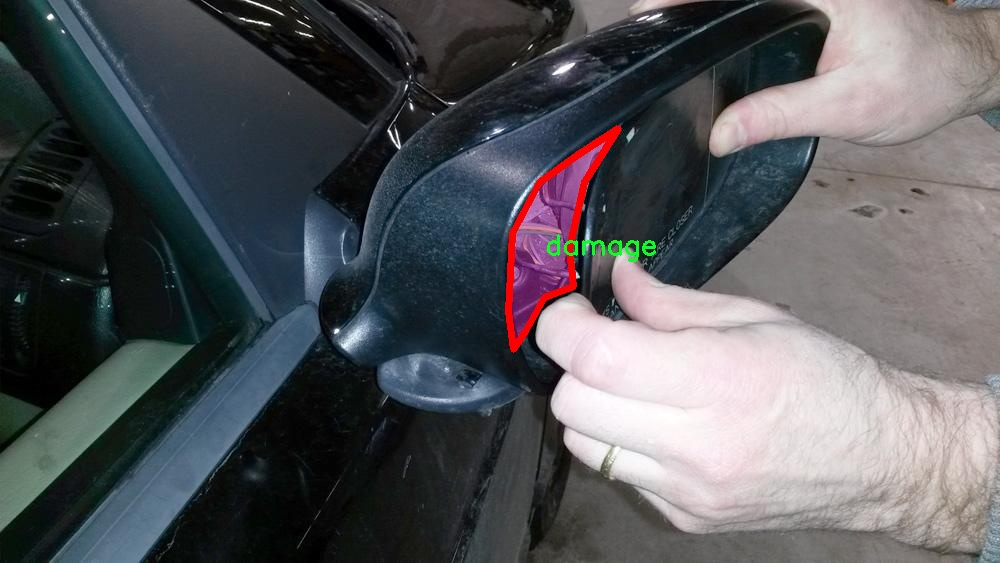
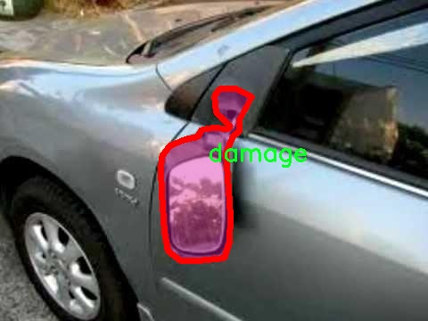
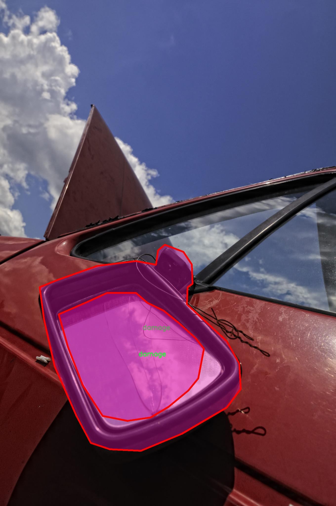

# 汽车损伤图像分割系统源码＆数据集分享
 [yolov8-seg-HGNetV2＆yolov8-seg-C2f-Parc等50+全套改进创新点发刊_一键训练教程_Web前端展示]

### 1.研究背景与意义

项目参考[ILSVRC ImageNet Large Scale Visual Recognition Challenge](https://gitee.com/YOLOv8_YOLOv11_Segmentation_Studio/projects)

项目来源[AAAI Global Al lnnovation Contest](https://kdocs.cn/l/cszuIiCKVNis)

研究背景与意义

随着汽车工业的快速发展，汽车损伤检测与评估已成为汽车维护和保险理赔中的重要环节。传统的损伤评估方法通常依赖于人工检查，不仅耗时耗力，而且容易受到主观因素的影响，导致评估结果的不准确性。因此，开发一种高效、准确的汽车损伤图像分割系统显得尤为重要。近年来，深度学习技术的迅猛发展为图像处理领域带来了新的机遇，尤其是基于卷积神经网络（CNN）的目标检测与分割算法在多个应用场景中展现出了优越的性能。

YOLO（You Only Look Once）系列算法作为一种实时目标检测技术，因其高效性和准确性而受到广泛关注。YOLOv8作为该系列的最新版本，进一步提升了模型的性能和适用性，尤其在处理复杂场景和多目标检测方面表现突出。然而，现有的YOLOv8模型在汽车损伤图像分割任务中仍存在一定的局限性，主要体现在对细微损伤的识别能力不足和分割精度的提升空间。因此，基于改进YOLOv8的汽车损伤图像分割系统的研究具有重要的理论价值和实际意义。

本研究所使用的数据集包含1400张汽车损伤图像，涵盖10个类别的损伤类型。这一数据集的丰富性为模型的训练和验证提供了坚实的基础。通过对不同损伤类型的图像进行标注，研究者能够深入分析各种损伤特征，并针对性地优化模型结构和训练策略，以提高模型在实际应用中的表现。此外，数据集的开放性（CC BY 4.0许可证）也为学术界和工业界的研究提供了便利，促进了相关技术的共享与合作。

在汽车损伤检测领域，图像分割技术的应用能够有效地提取损伤区域，进而为后续的损伤评估和修复提供准确的数据支持。通过将改进的YOLOv8模型应用于汽车损伤图像分割，研究者不仅能够提高损伤检测的准确性，还能够实现对损伤程度的量化分析，为汽车维修和保险理赔提供科学依据。此外，基于深度学习的自动化检测系统能够显著降低人工成本，提高工作效率，推动汽车行业的智能化发展。

综上所述，基于改进YOLOv8的汽车损伤图像分割系统的研究，不仅有助于提升汽车损伤检测的准确性和效率，还能为相关领域的技术进步提供重要的理论支持和实践指导。随着智能汽车和自动驾驶技术的不断发展，汽车损伤检测的需求将日益增加，因此，本研究的成果将具有广泛的应用前景和深远的社会意义。

### 2.图片演示







##### 注意：由于此博客编辑较早，上面“2.图片演示”和“3.视频演示”展示的系统图片或者视频可能为老版本，新版本在老版本的基础上升级如下：（实际效果以升级的新版本为准）

  （1）适配了YOLOV8的“目标检测”模型和“实例分割”模型，通过加载相应的权重（.pt）文件即可自适应加载模型。

  （2）支持“图片识别”、“视频识别”、“摄像头实时识别”三种识别模式。

  （3）支持“图片识别”、“视频识别”、“摄像头实时识别”三种识别结果保存导出，解决手动导出（容易卡顿出现爆内存）存在的问题，识别完自动保存结果并导出到tempDir中。

  （4）支持Web前端系统中的标题、背景图等自定义修改，后面提供修改教程。

  另外本项目提供训练的数据集和训练教程,暂不提供权重文件（best.pt）,需要您按照教程进行训练后实现图片演示和Web前端界面演示的效果。

### 3.视频演示

[3.1 视频演示](https://www.bilibili.com/video/BV1TuydYnEnn/)

### 4.数据集信息展示

##### 4.1 本项目数据集详细数据（类别数＆类别名）

nc: 1
names: ['damage']


##### 4.2 本项目数据集信息介绍

数据集信息展示

在本研究中，我们使用了名为“etc Dataset”的数据集，以支持对YOLOv8-seg模型的训练，旨在改进汽车损伤图像的分割系统。该数据集专注于汽车损伤的检测与分割，提供了一个高质量的图像基础，能够有效地训练深度学习模型，提升其在实际应用中的表现。数据集的设计充分考虑了汽车损伤的多样性和复杂性，确保了模型在不同情况下的鲁棒性和准确性。

“etc Dataset”包含了丰富的汽车损伤图像，所有图像均经过精心标注，确保每一幅图像中的损伤区域都得到了准确的识别和分割。该数据集的类别数量为1，具体类别为“damage”，这意味着所有图像均聚焦于汽车损伤的表现。这一单一类别的设计使得模型在特定任务上的训练更加集中，能够深入学习损伤特征，从而提高分割的精度和效率。

在数据集的构建过程中，研究团队特别注重图像的多样性，涵盖了不同类型的汽车、不同的损伤情况以及在不同环境下拍摄的图像。这种多样性不仅包括了轻微划痕、凹陷到严重碰撞的各种损伤类型，还考虑了不同光照条件、角度和背景对图像质量的影响。通过这种方式，数据集为模型提供了一个全面的训练基础，使其能够适应各种现实场景中的汽车损伤检测任务。

此外，数据集的图像质量也得到了严格把控，确保每幅图像在分辨率和清晰度上都能够满足深度学习模型的需求。高质量的图像能够有效减少模型训练过程中的噪声，提高模型的学习效率和最终的分割效果。为了进一步增强数据集的实用性，研究团队还进行了数据增强处理，包括旋转、缩放、翻转等操作，以扩展数据集的规模和多样性。这些技术手段不仅增加了训练样本的数量，还提升了模型的泛化能力，使其在面对未见过的损伤类型时，依然能够保持较高的识别准确率。

在模型训练过程中，研究团队将“etc Dataset”与YOLOv8-seg模型相结合，利用其先进的特征提取和分割能力，进行端到端的训练。通过对损伤区域的精准分割，模型能够有效地识别出汽车的损伤情况，为后续的损伤评估和修复提供重要依据。这一过程不仅提高了损伤检测的自动化水平，也为汽车维修行业带来了更高的效率和准确性。

综上所述，“etc Dataset”作为本研究的核心数据基础，凭借其丰富的图像资源和精确的标注信息，为改进YOLOv8-seg的汽车损伤图像分割系统提供了强有力的支持。通过对该数据集的深入分析和利用，我们期待能够实现更高效、更精准的汽车损伤检测与分割，为未来的智能汽车维修技术发展奠定坚实的基础。











### 5.全套项目环境部署视频教程（零基础手把手教学）

[5.1 环境部署教程链接（零基础手把手教学）](https://www.bilibili.com/video/BV1jG4Ve4E9t/?vd_source=bc9aec86d164b67a7004b996143742dc)


[5.2 安装Python虚拟环境创建和依赖库安装视频教程链接（零基础手把手教学）](https://www.bilibili.com/video/BV1nA4VeYEze/?vd_source=bc9aec86d164b67a7004b996143742dc)

### 6.手把手YOLOV8-seg训练视频教程（零基础小白有手就能学会）

[6.1 手把手YOLOV8-seg训练视频教程（零基础小白有手就能学会）](https://www.bilibili.com/video/BV1cA4VeYETe/?vd_source=bc9aec86d164b67a7004b996143742dc)


按照上面的训练视频教程链接加载项目提供的数据集，运行train.py即可开始训练



     Epoch   gpu_mem       box       obj       cls    labels  img_size
     1/200     0G   0.01576   0.01955  0.007536        22      1280: 100%|██████████| 849/849 [14:42<00:00,  1.04s/it]
               Class     Images     Labels          P          R     mAP@.5 mAP@.5:.95: 100%|██████████| 213/213 [01:14<00:00,  2.87it/s]
                 all       3395      17314      0.994      0.957      0.0957      0.0843

     Epoch   gpu_mem       box       obj       cls    labels  img_size
     2/200     0G   0.01578   0.01923  0.007006        22      1280: 100%|██████████| 849/849 [14:44<00:00,  1.04s/it]
               Class     Images     Labels          P          R     mAP@.5 mAP@.5:.95: 100%|██████████| 213/213 [01:12<00:00,  2.95it/s]
                 all       3395      17314      0.996      0.956      0.0957      0.0845

     Epoch   gpu_mem       box       obj       cls    labels  img_size
     3/200     0G   0.01561    0.0191  0.006895        27      1280: 100%|██████████| 849/849 [10:56<00:00,  1.29it/s]
               Class     Images     Labels          P          R     mAP@.5 mAP@.5:.95: 100%|███████   | 187/213 [00:52<00:00,  4.04it/s]
                 all       3395      17314      0.996      0.957      0.0957      0.0845


### 7.50+种全套YOLOV8-seg创新点代码加载调参视频教程（一键加载写好的改进模型的配置文件）

[7.1 50+种全套YOLOV8-seg创新点代码加载调参视频教程（一键加载写好的改进模型的配置文件）](https://www.bilibili.com/video/BV1Hw4VePEXv/?vd_source=bc9aec86d164b67a7004b996143742dc)

### 8.YOLOV8-seg图像分割算法原理

原始YOLOv8-seg算法原理

YOLOv8-seg算法是YOLO系列目标检测模型的最新迭代，结合了目标检测与语义分割的能力，旨在为复杂场景中的物体识别与分割提供高效且准确的解决方案。该算法在YOLOv5的基础上进行了全面的优化和升级，主要由三个核心部分构成：主干网络（Backbone）、颈部网络（Neck）和头部网络（Head）。在这三个部分中，YOLOv8-seg不仅提升了目标检测的精度和速度，还引入了新的特征提取和融合机制，以适应多种应用场景。

首先，YOLOv8-seg的主干网络采用了轻量化的CSPDarknet结构，这一结构通过跨阶段的部分连接（Cross Stage Partial connections）有效地提高了特征提取的效率。CSPDarknet将输入特征图分为多个分支，经过不同的卷积层进行处理，从而实现更深层次的特征抽象。这种设计不仅提升了模型的表达能力，还有效地减轻了计算负担。与前代模型相比，YOLOv8-seg在主干网络中引入了C2F模块，这一模块通过将卷积操作替换为3×3的卷积，并通过深度可分离卷积来减少参数量，从而实现轻量化的目标。C2F模块的设计理念在于增强特征图的梯度流动，使得模型在训练过程中能够更好地捕捉到细微的特征变化。

在特征融合层，YOLOv8-seg结合了特征金字塔网络（FPN）和路径聚合网络（PAN）的优势，形成了一种高效的特征融合机制。FPN通过构建金字塔结构，能够有效地处理不同尺度的特征信息，而PAN则通过路径聚合的方式增强了特征的传递能力。这种双重融合策略使得YOLOv8-seg在处理复杂场景时，能够更好地捕捉到多尺度的上下文信息，进而提升了目标检测和分割的精度。此外，YOLOv8-seg还引入了BiFPN（Bidirectional Feature Pyramid Network）网络，通过高效的双向跨尺度连接和加权特征融合，进一步提高了特征提取的速度和准确性。

在头部网络部分，YOLOv8-seg采用了解耦的检测头结构，分别处理目标的回归和分类任务。这种解耦设计的优势在于能够独立优化回归和分类的损失函数，从而提高模型的整体性能。与传统的锚框检测方法不同，YOLOv8-seg采用无锚框（Anchor-Free）的检测方式，直接预测目标的中心点及其宽高比例，这一创新不仅减少了锚框的数量，还显著提高了检测速度和准确度。通过这种方式，YOLOv8-seg能够在实时检测任务中表现出色，适应各种动态场景的需求。

YOLOv8-seg的另一个重要特性是其对语义分割的支持。通过在检测头中引入分割分支，YOLOv8-seg能够在进行目标检测的同时，输出每个目标的精确分割掩码。这一功能的实现依赖于在特征融合层中提取的丰富特征信息，使得模型能够对目标的形状和边界进行细致的识别。通过结合目标检测与语义分割，YOLOv8-seg为诸如自动驾驶、视频监控和智能安防等应用提供了更为全面的解决方案。

综上所述，YOLOv8-seg算法通过对主干网络、特征融合层和检测头的创新设计，极大地提升了目标检测与分割的性能。其轻量化的结构和高效的特征提取机制，使得YOLOv8-seg在处理复杂场景时，能够实现快速且准确的目标识别与分割。这一算法的推出，不仅为YOLO系列模型的进一步发展奠定了基础，也为计算机视觉领域的多种应用提供了新的思路和方法。随着YOLOv8-seg的不断优化和推广，预计将在实际应用中展现出更大的潜力和价值。


### 9.系统功能展示（检测对象为举例，实际内容以本项目数据集为准）

图9.1.系统支持检测结果表格显示

  图9.2.系统支持置信度和IOU阈值手动调节

  图9.3.系统支持自定义加载权重文件best.pt(需要你通过步骤5中训练获得)

  图9.4.系统支持摄像头实时识别

  图9.5.系统支持图片识别

  图9.6.系统支持视频识别

  图9.7.系统支持识别结果文件自动保存

  图9.8.系统支持Excel导出检测结果数据


### 10.50+种全套YOLOV8-seg创新点原理讲解（非科班也可以轻松写刊发刊，V11版本正在科研待更新）

#### 10.1 由于篇幅限制，每个创新点的具体原理讲解就不一一展开，具体见下列网址中的创新点对应子项目的技术原理博客网址【Blog】：


[10.1 50+种全套YOLOV8-seg创新点原理讲解链接](https://gitee.com/qunmasj/good)

#### 10.2 部分改进模块原理讲解(完整的改进原理见上图和技术博客链接)【如果此小节的图加载失败可以通过CSDN或者Github搜索该博客的标题访问原始博客，原始博客图片显示正常】
### YOLOv8简介
YOLOv8目标检测算法继承了YOLOv1系列的思考,是一种新型端到端的目标检测算法,尽管现在原始检测算法已经开源,但是鲜有发表的相关论文.YOLOv8的网络结构如图所示,主要可分为Input输入端、Backbone骨干神经网络、Neck 混合特征网络层和Head预测层网络共4个部分.

YOLO目标检测算法是一种端到端的One-Slage 目标检测算法，其核心思想是将图像按区域分块进行预测。YOLO将输入图像按照32x32的大小划分成若干个网格，例如416x416的图像将被划分为13x13个网格。当目标物体的中心位于某个网格内时,该网格就会负责输出该物体的边界框和类别置信度。每个网格可以预测多个边界框和多个目标类别,这些边界框和类别的数量可以根据需要进行设置。YOLO算法的输出是一个特征图,包含了每个网格对应的边界框和类别置信度的信息呵。本文采用YOLO最新的YOLOv8模型，其是2022年底发布的最新YOLO系列模型，采用全新的SOTA模型，全新的网络主干结构,如图1所示。
整个网络分为Backbone 骨干网络部分和Head头部网络部分。YOLOv8汲取了前几代网络的优秀特性，骨干网络和 Neck部分遵循CSP的思想，将YOLOv5中的C3模块被替换成了梯度流更丰富C2模块,去掉YOLOv5中 PAN-FPN上采样阶段中的卷积结构,将Backbone不同阶段输出的特征直接送入了上采样操作,模型提供了N/S/M/L/X尺度的不同大小模型,能够满足不同领域业界的需求。本文基于YOLOv8模型设计番茄病虫害检测系统，通过配置模型参数训练番茄图像,得到能够用于部署应用的最优模型。


### 感受野注意力卷积（RFAConv)
#### 标准卷积操作回顾
标准的卷积操作是构造卷积神经网络的基本构件。它利用具有共享参数的滑动窗口提取特征信息，克服了全连通层构造神经网络固有的参数多、计算开销大的问题。设 X R∈C×H×W
表示输入特征图，其中C、H、W分别表示特征图的通道数、高度、宽度。为了清楚地演示卷积核的特征提取过程，我们使用 C = 1 的例子。从每个接受域滑块中提取特征信息的卷积运算可以表示为:


这里，Fi 表示计算后每个卷积滑块得到的值，Xi 表示每个滑块内对应位置的像素值，K表示卷积核，S表示卷积核中的参数个数，N表示接收域滑块的总数。可以看出，每个滑块内相同位置的 feature共享相同的参数Ki。因此，标准的卷积运算并不能捕捉到不同位置所带来的信息差异，这最终在一定程度上限制了卷积神经网络的性能。 

#### 空间注意力回顾
目前，空间注意机制是利用学习得到的注意图来突出每个特征的重要性。与前一节类似，这里以 C=1为例。突出关键特征的空间注意机制可以简单表述为:这里，Fi 表示加权运算后得到的值。xi 和Ai 表示输入特征图和学习到的注意图在不同位置的值，N为输入特征图的高和宽的乘积，表示像素值的总数。


#### 空间注意与标准卷积运算
将注意力机制整合到卷积神经网络中，可以提高卷积神经网络的性能。通过对标准卷积运算和现有空间注意机制的研究，我们认为空间注意机制有效地克服了卷积神经网络固有的参数共享的局限性。目前卷积神经网络中最常用的核大小是 1 × 1和3 × 3。在引入空间注意机制后，提取特征的卷积操作可以是 1 × 1或3 × 3卷积操作。为了直观地展示这个过程，在 1 × 1卷积运算的前面插入了空间注意机制。通过注意图对输入特征图(Re-weight“×”)进行加权运算，最后通过 1 × 1卷积运算提取接收域的滑块特征信息。整个过程可以简单地表示如下:


 这里卷积核K仅代表一个参数值。如果取A i× ki 的值作为一种新的卷积核参数，有趣的是它解决了 1×1卷积运算提取特征时的参数共享问题。然而，关于空间注意机制的传说到此结束。当空间注意机制被插入到3×3卷积运算前面时。具体情况如下:


如上所述，如果取A的值 i × ki (4)式作为一种新的卷积核参数，完全解决了大规模卷积核的参数共享问题。然而，最重要的一点是，卷积核在提取每个接受域滑块的特征时，会共享一些特征。换句话说，每个接收域滑块内都有一个重叠。仔细分析后会发现A12= a21， a13 = a22， a15 = a24……，在这种情况下，每个滑动窗口共享空间注意力地图的权重。因此，空间注意机制没有考虑整个接受域的空间特征，不能有效地解决大规模卷积核的参数共享问题。因此，空间注意机制的有效性受到限制。 

#### 创新空间注意力和标准卷积操作
该博客提出解决了现有空间注意机制的局限性，为空间处理提供了一种创新的解决方案。受RFA的启发，一系列空间注意机制被开发出来，可以进一步提高卷积神经网络的性能。RFA可以看作是一个轻量级即插即用模块，RFA设计的卷积运算(RFAConv)可以代替标准卷积来提高卷积神经网络的性能。因此，我们预测空间注意机制与标准卷积运算的结合将继续发展，并在未来带来新的突破。
接受域空间特征:为了更好地理解接受域空间特征的概念，我们将提供相关的定义。接收域空间特征是专门为卷积核设计的，并根据核大小动态生成。如图1所示，以3×3卷积核为例。在图1中，“Spatial Feature”指的是原始的Feature map。“接受域空间特征”是空间特征变换后的特征图。

 

由不重叠的滑动窗口组成。当使用 3×3卷积内核提取特征时，接收域空间特征中的每个 3×3大小窗口代表一个接收域滑块。接受域注意卷积(RFAConv):针对接受域的空间特征，我们提出了接受域注意卷积(RFA)。该方法不仅强调了接收域滑块内不同特征的重要性，而且对接收域空间特征进行了优先排序。通过该方法，完全解决了卷积核参数共享的问题。接受域空间特征是根据卷积核的大小动态生成的，因此，RFA是卷积的固定组合，不能与卷积操作的帮助分离，卷积操作同时依赖于RFA来提高性能，因此我们提出了接受场注意卷积(RFAConv)。具有3×3大小的卷积核的RFAConv整体结构如图所示。


目前，最广泛使用的接受域特征提取方法是缓慢的。经过大量的研究，我们开发了一种快速的方法，用分组卷积来代替原来的方法。具体来说，我们利用相应大小的分组卷积来动态生成基于接受域大小的展开特征。尽管与原始的无参数方法(如PyTorch提供的nn.())相比，该方法增加了一些参数，但它的速度要快得多。注意:如前一节所述，当使用 3×3卷积内核提取特征时，接收域空间特征中的每个 3×3大小窗口表示一个接收域滑块。而利用快速分组卷积提取感受野特征后，将原始特征映射为新的特征。最近的研究表明。交互信息可以提高网络性能，如[40,41,42]所示。同样，对于RFAConv来说，通过交互接受域特征信息来学习注意图可以提高网络性能。然而，与每个接收域特征交互会导致额外的计算开销，因此为了最小化计算开销和参数的数量，我们使用AvgPool来聚合每个接收域特征的全局信息。然后，使用 1×1 组卷积操作进行信息交互。最后，我们使用softmax来强调每个特征在接受域特征中的重要性。一般情况下，RFA的计算可以表示为:


这里gi×i 表示一个大小为 i×i的分组卷积，k表示卷积核的大小，Norm表示归一化，X表示输入的特征图，F由注意图 a相乘得到 rf 与转换后的接受域空间特征 Frf。与CBAM和CA不同，RFA能够为每个接受域特征生成注意图。卷积神经网络的性能受到标准卷积操作的限制，因为卷积操作依赖于共享参数，对位置变化带来的信息差异不敏感。然而，RFAConv通过强调接收域滑块中不同特征的重要性，并对接收域空间特征进行优先级排序，可以完全解决这个问题。通过RFA得到的feature map是接受域空间特征，在“Adjust Shape”后没有重叠。因此，学习到的注意图将每个接受域滑块的特征信息聚合起来。换句话说，注意力地图不再共享在每个接受域滑块。这完全弥补了现有 CA和CBAM注意机制的不足。RFA为标准卷积内核提供了显著的好处。而在调整形状后，特征的高度和宽度是 k倍，需要进行 stride = k的k × k卷积运算来提取特征信息。RFA设计的卷积运算RFAConv为卷积带来了良好的增益，对标准卷积进行了创新。
此外，我们认为现有的空间注意机制应该优先考虑接受域空间特征，以提高网络性能。众所周知，基于自注意机制的网络模型[43,44,45]取得了很大的成功，因为它解决了卷积参数共享的问题，并对远程信息进行建模。然而，自注意机制也为模型引入了显著的计算开销和复杂性。我们认为，将现有的空间注意机制的注意力引导到接受场空间特征上，可以以类似于自我注意的方式解决长期信息的参数共享和建模问题。与自我关注相比，这种方法需要的参数和计算资源少得多。答案如下:(1)将以接收场空间特征为中心的空间注意机制与卷积相结合，消除了卷积参数共享的问题。(2)现有的空间注意机制已经考虑了远程信息，可以通过全局平均池或全局最大池的方式获取全局信息，其中明确考虑了远程信息。因此，我们设计了新的 CBAM和CA模型，称为RFCBAM和RFCA，它们专注于接受域空间特征。与RFA类似，使用最终的k × k stride = k 的卷积运算来提取特征信息。这两种新的卷积方法的具体结构如图 3所示，我们称这两种新的卷积操作为 RFCBAMConv和RFCAConv。与原来的CBAM相比，我们在RFCBAM中使用SE attention来代替CAM。因为这样可以减少计算开销。此外，在RFCBAM中，通道注意和空间注意不是分开执行的。相反，它们是同时加权的，使得每个通道获得的注意力地图是不同的。


### 11.项目核心源码讲解（再也不用担心看不懂代码逻辑）

#### 11.1 ui.py

以下是对代码的核心部分进行保留和详细注释的版本：

```python
import sys
import subprocess

def run_script(script_path):
    """
    使用当前 Python 环境运行指定的脚本。

    Args:
        script_path (str): 要运行的脚本路径

    Returns:
        None
    """
    # 获取当前 Python 解释器的路径
    python_path = sys.executable

    # 构建运行命令，使用 streamlit 运行指定的脚本
    command = f'"{python_path}" -m streamlit run "{script_path}"'

    # 执行命令
    result = subprocess.run(command, shell=True)
    
    # 检查命令执行结果，如果返回码不为0，表示出错
    if result.returncode != 0:
        print("脚本运行出错。")

# 实例化并运行应用
if __name__ == "__main__":
    # 指定要运行的脚本路径
    script_path = "web.py"  # 这里可以直接指定脚本名

    # 调用函数运行脚本
    run_script(script_path)
```

### 代码核心部分说明：
1. **导入模块**：
   - `sys`：用于获取当前 Python 解释器的路径。
   - `subprocess`：用于执行外部命令。

2. **`run_script` 函数**：
   - 该函数接收一个脚本路径作为参数，并使用当前 Python 环境运行该脚本。
   - 使用 `sys.executable` 获取当前 Python 解释器的路径。
   - 构建命令字符串，使用 `streamlit` 模块运行指定的脚本。
   - 使用 `subprocess.run` 执行命令，并检查返回码以判断脚本是否成功运行。

3. **主程序入口**：
   - 当脚本作为主程序运行时，指定要运行的脚本路径（这里是 `web.py`）。
   - 调用 `run_script` 函数执行该脚本。 

### 注意事项：
- `abs_path` 函数被移除，直接使用脚本名，假设该脚本与当前工作目录在同一位置。
- 如果需要处理更复杂的路径或文件，可以在后续代码中重新引入路径处理逻辑。

这个程序文件 `ui.py` 的主要功能是运行一个指定的 Python 脚本，具体来说是使用 Streamlit 框架来启动一个 Web 应用。代码中首先导入了必要的模块，包括 `sys`、`os` 和 `subprocess`，以及一个自定义的 `abs_path` 函数，这个函数可能用于获取文件的绝对路径。

在 `run_script` 函数中，首先获取当前 Python 解释器的路径，这样可以确保使用正确的 Python 环境来运行脚本。接着，构建一个命令字符串，这个命令会调用 Streamlit 来运行指定的脚本。命令的格式是 `python -m streamlit run "script_path"`，其中 `script_path` 是要运行的脚本的路径。

使用 `subprocess.run` 方法来执行这个命令，`shell=True` 参数允许在 shell 中执行命令。执行后，程序会检查返回码，如果返回码不为 0，说明脚本运行过程中出现了错误，程序会打印出相应的错误信息。

在文件的最后部分，使用 `if __name__ == "__main__":` 来确保只有在直接运行这个文件时才会执行后面的代码。这里指定了要运行的脚本路径为 `web.py`，并调用 `run_script` 函数来启动这个脚本。

总体来说，这个文件的功能是为一个 Streamlit 应用提供一个启动器，通过调用指定的 Python 脚本来启动 Web 应用。

#### 11.2 ultralytics\models\yolo\detect\val.py

以下是经过简化和注释的核心代码部分：

```python
import torch
from ultralytics.engine.validator import BaseValidator
from ultralytics.utils import LOGGER, ops
from ultralytics.utils.metrics import DetMetrics, box_iou
from ultralytics.utils.plotting import output_to_target, plot_images

class DetectionValidator(BaseValidator):
    """
    继承自BaseValidator类，用于基于检测模型的验证。
    """

    def __init__(self, dataloader=None, save_dir=None, args=None):
        """初始化检测模型所需的变量和设置。"""
        super().__init__(dataloader, save_dir, args=args)
        self.metrics = DetMetrics(save_dir=self.save_dir)  # 初始化检测指标
        self.iouv = torch.linspace(0.5, 0.95, 10)  # 定义IoU向量用于mAP计算
        self.niou = self.iouv.numel()  # IoU的数量

    def preprocess(self, batch):
        """对YOLO训练的图像批次进行预处理。"""
        # 将图像移动到设备上并进行归一化处理
        batch['img'] = batch['img'].to(self.device, non_blocking=True) / 255
        batch['img'] = batch['img'].half() if self.args.half else batch['img'].float()
        
        # 将其他必要的数据移动到设备上
        for k in ['batch_idx', 'cls', 'bboxes']:
            batch[k] = batch[k].to(self.device)
        
        return batch

    def postprocess(self, preds):
        """对预测输出应用非极大值抑制（NMS）。"""
        return ops.non_max_suppression(preds, self.args.conf, self.args.iou)

    def update_metrics(self, preds, batch):
        """更新检测指标。"""
        for si, pred in enumerate(preds):
            idx = batch['batch_idx'] == si  # 获取当前批次的索引
            cls = batch['cls'][idx]  # 获取当前批次的类别
            bbox = batch['bboxes'][idx]  # 获取当前批次的边界框
            
            npr = pred.shape[0]  # 当前预测的数量
            correct_bboxes = torch.zeros(npr, self.niou, dtype=torch.bool, device=self.device)  # 初始化正确边界框
            
            if npr == 0:  # 如果没有预测
                continue

            # 处理预测
            predn = pred.clone()  # 克隆预测
            ops.scale_boxes(batch['img'][si].shape[1:], predn[:, :4], batch['ori_shape'][si])  # 将预测缩放到原始图像空间
            
            # 评估
            if cls.shape[0]:  # 如果有标签
                labelsn = torch.cat((cls, bbox), 1)  # 将标签和边界框合并
                correct_bboxes = self._process_batch(predn, labelsn)  # 处理批次
            
            # 保存结果
            self.stats.append((correct_bboxes, pred[:, 4], pred[:, 5], cls.squeeze(-1)))  # 保存统计信息

    def get_stats(self):
        """返回指标统计信息和结果字典。"""
        stats = [torch.cat(x, 0).cpu().numpy() for x in zip(*self.stats)]  # 转换为numpy数组
        if len(stats) and stats[0].any():
            self.metrics.process(*stats)  # 处理指标
        return self.metrics.results_dict  # 返回结果字典

    def print_results(self):
        """打印每个类别的训练/验证集指标。"""
        pf = '%22s' + '%11i' * 2 + '%11.3g' * len(self.metrics.keys)  # 打印格式
        LOGGER.info(pf % ('all', self.seen, self.nt_per_class.sum(), *self.metrics.mean_results()))  # 打印总体结果

    def _process_batch(self, detections, labels):
        """
        返回正确预测矩阵。
        """
        iou = box_iou(labels[:, 1:], detections[:, :4])  # 计算IoU
        return self.match_predictions(detections[:, 5], labels[:, 0], iou)  # 匹配预测与标签
```

### 代码说明：
1. **DetectionValidator类**：该类用于YOLO模型的验证，继承自`BaseValidator`。
2. **初始化方法**：设置必要的变量和指标，定义IoU的范围。
3. **预处理方法**：对输入的图像批次进行归一化和设备迁移。
4. **后处理方法**：应用非极大值抑制来过滤掉重复的预测框。
5. **更新指标方法**：根据预测结果和真实标签更新检测指标。
6. **获取统计信息方法**：将统计信息转换为numpy数组并返回结果字典。
7. **打印结果方法**：打印每个类别的检测结果和指标。
8. **处理批次方法**：计算预测框与真实框之间的IoU，并返回正确的预测矩阵。

这个程序文件是Ultralytics YOLO模型的验证模块，主要用于对目标检测模型的性能进行评估。文件中定义了一个名为`DetectionValidator`的类，该类继承自`BaseValidator`，并实现了一系列方法来处理数据、计算指标、保存结果等。

在初始化方法中，`DetectionValidator`类设置了一些基本参数，包括数据加载器、保存目录、进度条、参数等。它还初始化了一些用于计算检测性能的指标，如`DetMetrics`和`ConfusionMatrix`，并定义了一个IoU（Intersection over Union）向量，用于计算mAP（mean Average Precision）。

`preprocess`方法负责对输入的图像批次进行预处理，包括将图像转换为合适的格式和范围，以及处理边界框（bboxes）和类别（cls）。如果设置了保存混合标签的选项，它还会准备用于自动标注的数据。

`init_metrics`方法用于初始化评估指标，判断数据集是否为COCO格式，并设置相关的类别映射和名称。`get_desc`方法返回一个格式化的字符串，用于描述每个类别的指标。

在`postprocess`方法中，程序对模型的预测结果应用非极大值抑制（NMS），以减少重叠的边界框。`update_metrics`方法则用于更新模型的评估指标，包括计算每个预测的正确性，并将结果保存到指定的文件中。

`finalize_metrics`方法用于设置最终的指标值，而`get_stats`方法则返回当前的指标统计信息。`print_results`方法负责打印训练或验证集的每个类别的指标，包括图像数量、实例数量和各种性能指标。

`build_dataset`和`get_dataloader`方法用于构建YOLO数据集和数据加载器，确保在验证时能够正确加载数据。`plot_val_samples`和`plot_predictions`方法用于可视化验证样本和模型的预测结果。

`save_one_txt`和`pred_to_json`方法分别用于将检测结果保存为文本文件和COCO格式的JSON文件，以便后续分析和评估。`eval_json`方法则用于评估YOLO输出的JSON格式结果，并返回性能统计信息。

总体而言，这个文件实现了YOLO模型验证的完整流程，从数据预处理到指标计算，再到结果保存和评估，提供了一个系统化的框架来评估目标检测模型的性能。

#### 11.3 ultralytics\models\yolo\segment\__init__.py

```python
# 导入必要的模块
# Ultralytics YOLO 🚀, AGPL-3.0 license

# 从当前包中导入SegmentationPredictor类，用于图像分割的预测
from .predict import SegmentationPredictor

# 从当前包中导入SegmentationTrainer类，用于训练图像分割模型
from .train import SegmentationTrainer

# 从当前包中导入SegmentationValidator类，用于验证图像分割模型的性能
from .val import SegmentationValidator

# 定义模块的公开接口，允许外部访问这三个类
__all__ = 'SegmentationPredictor', 'SegmentationTrainer', 'SegmentationValidator'
```

### 代码核心部分说明：
1. **导入模块**：代码从当前包中导入了三个类，分别用于图像分割的预测、训练和验证。这些类是实现YOLO（You Only Look Once）算法在图像分割任务中的核心功能。
   
2. **公开接口**：通过`__all__`变量，定义了模块的公开接口，只有列出的类可以被外部访问。这是为了控制模块的可用性，确保用户只使用预期的功能。

这个程序文件是Ultralytics YOLO项目中的一个模块，主要用于图像分割任务。文件的第一行是一个注释，表明该项目使用的是AGPL-3.0许可证，并且是Ultralytics YOLO的相关代码。

接下来的几行代码通过相对导入的方式引入了三个类：`SegmentationPredictor`、`SegmentationTrainer`和`SegmentationValidator`。这些类分别负责图像分割的预测、训练和验证功能。具体来说，`SegmentationPredictor`可能用于执行分割任务的推理，`SegmentationTrainer`用于训练模型，而`SegmentationValidator`则用于评估模型的性能。

最后一行代码定义了`__all__`，这是一个特殊的变量，用于指定当使用`from module import *`语句时，哪些名称会被导入。在这里，`__all__`包含了三个类的名称，确保在使用通配符导入时，这些类是可用的。

总体来说，这个文件的作用是组织和导出与图像分割相关的功能，使得其他模块可以方便地使用这些功能。

#### 11.4 train.py

以下是代码中最核心的部分，并附上详细的中文注释：

```python
import os
import torch
import yaml
from ultralytics import YOLO  # 导入YOLO模型

if __name__ == '__main__':  # 确保该模块被直接运行时才执行以下代码
    # 设置训练参数
    workers = 1  # 数据加载的工作进程数
    batch = 8  # 每个批次的样本数量
    device = "0" if torch.cuda.is_available() else "cpu"  # 判断是否使用GPU

    # 获取数据集的yaml配置文件的绝对路径
    data_path = abs_path(f'datasets/data/data.yaml', path_type='current')  

    # 读取YAML文件，保持原有顺序
    with open(data_path, 'r') as file:
        data = yaml.load(file, Loader=yaml.FullLoader)

    # 修改数据集中训练、验证和测试集的路径
    if 'train' in data and 'val' in data and 'test' in data:
        directory_path = os.path.dirname(data_path.replace(os.sep, '/'))  # 获取目录路径
        data['train'] = directory_path + '/train'  # 更新训练集路径
        data['val'] = directory_path + '/val'      # 更新验证集路径
        data['test'] = directory_path + '/test'    # 更新测试集路径

        # 将修改后的数据写回YAML文件
        with open(data_path, 'w') as file:
            yaml.safe_dump(data, file, sort_keys=False)

    # 加载YOLO模型配置并加载预训练权重
    model = YOLO(r"C:\codeseg\codenew\50+种YOLOv8算法改进源码大全和调试加载训练教程（非必要）\改进YOLOv8模型配置文件\yolov8-seg-C2f-Faster.yaml").load("./weights/yolov8s-seg.pt")

    # 开始训练模型
    results = model.train(  
        data=data_path,  # 指定训练数据的配置文件路径
        device=device,  # 使用指定的设备进行训练
        workers=workers,  # 指定使用的工作进程数
        imgsz=640,  # 指定输入图像的大小为640x640
        epochs=100,  # 指定训练的轮数为100
        batch=batch,  # 指定每个批次的大小
    )
```

### 代码核心部分说明：
1. **导入必要的库**：导入了处理文件路径、深度学习框架（PyTorch）、YAML文件处理和YOLO模型的相关库。
2. **设置训练参数**：定义了工作进程数、批次大小和设备类型（GPU或CPU）。
3. **读取和修改YAML配置文件**：加载数据集的配置文件，更新训练、验证和测试集的路径，并将修改后的内容写回文件。
4. **加载YOLO模型**：根据指定的配置文件和预训练权重加载YOLO模型。
5. **开始训练模型**：调用模型的训练方法，传入数据路径、设备、工作进程数、图像大小、训练轮数和批次大小等参数。

这个程序文件`train.py`主要用于训练YOLO（You Only Look Once）模型，具体是YOLOv8的一个变种，进行目标检测或分割任务。代码的结构和功能可以分为几个部分。

首先，程序导入了必要的库，包括`os`、`torch`、`yaml`和`ultralytics`中的YOLO模型。这些库分别用于文件操作、深度学习框架、YAML文件处理和YOLO模型的实现。此外，还导入了`matplotlib`库，并设置其使用`TkAgg`后端，这通常用于图形界面的绘图。

接下来，程序的主逻辑在`if __name__ == '__main__':`语句块中执行，这确保了只有当该文件被直接运行时，以下代码才会被执行。首先，设置了一些训练参数，包括工作进程数`workers`、批次大小`batch`和设备类型`device`。设备类型会根据是否有可用的GPU（CUDA）来选择，如果有则使用GPU，否则使用CPU。

然后，程序通过`abs_path`函数获取数据集配置文件`data.yaml`的绝对路径，并将路径中的分隔符统一为Unix风格。接着，使用`os.path.dirname`获取数据集目录的路径，并打开YAML文件读取数据。程序会检查YAML文件中是否包含`train`、`val`和`test`字段，如果存在，则将这些字段的路径修改为当前目录下的`train`、`val`和`test`子目录，并将修改后的数据写回YAML文件。

在模型加载部分，程序创建了一个YOLO模型实例，指定了模型的配置文件路径，并加载了预训练的权重文件。这里的配置文件和权重文件的路径是硬编码的，用户可以根据需要进行修改。

最后，程序调用`model.train()`方法开始训练模型，传入训练数据的配置文件路径、设备类型、工作进程数、输入图像大小、训练的epoch数量和批次大小等参数。训练过程将根据这些参数进行，最终生成训练结果。

总体而言，这个程序文件提供了一个完整的YOLOv8模型训练流程，包括数据准备、模型配置和训练参数设置，适合用于目标检测或分割任务的深度学习项目。

#### 11.5 ultralytics\models\yolo\detect\predict.py

以下是代码中最核心的部分，并附上详细的中文注释：

```python
from ultralytics.engine.predictor import BasePredictor
from ultralytics.engine.results import Results
from ultralytics.utils import ops

class DetectionPredictor(BasePredictor):
    """
    DetectionPredictor类扩展了BasePredictor类，用于基于检测模型进行预测。
    """

    def postprocess(self, preds, img, orig_imgs):
        """
        对预测结果进行后处理，并返回Results对象的列表。

        参数:
        preds: 模型的预测结果，通常是边界框和置信度。
        img: 输入图像的原始形状，用于缩放边界框。
        orig_imgs: 原始输入图像，可以是一个批次的图像。

        返回:
        results: 包含处理后结果的Results对象列表。
        """
        # 应用非极大值抑制（NMS）来过滤冗余的预测框
        preds = ops.non_max_suppression(preds,
                                        self.args.conf,  # 置信度阈值
                                        self.args.iou,   # IOU阈值
                                        agnostic=self.args.agnostic_nms,  # 是否进行类别无关的NMS
                                        max_det=self.args.max_det,  # 最大检测框数量
                                        classes=self.args.classes)  # 过滤的类别

        # 如果输入的原始图像不是列表，则将其转换为numpy数组
        if not isinstance(orig_imgs, list):  # 输入图像是torch.Tensor而不是列表
            orig_imgs = ops.convert_torch2numpy_batch(orig_imgs)  # 转换为numpy批次

        results = []  # 初始化结果列表
        for i, pred in enumerate(preds):  # 遍历每个预测结果
            orig_img = orig_imgs[i]  # 获取对应的原始图像
            # 将预测框的坐标从缩放后的图像空间转换回原始图像空间
            pred[:, :4] = ops.scale_boxes(img.shape[2:], pred[:, :4], orig_img.shape)
            img_path = self.batch[0][i]  # 获取图像路径
            # 创建Results对象并添加到结果列表中
            results.append(Results(orig_img, path=img_path, names=self.model.names, boxes=pred))
        return results  # 返回处理后的结果列表
```

### 代码核心部分说明：
1. **类定义**：`DetectionPredictor`类继承自`BasePredictor`，用于实现基于YOLO模型的目标检测预测。
2. **后处理方法**：`postprocess`方法负责对模型的预测结果进行后处理，包括应用非极大值抑制（NMS）来去除冗余的检测框，并将预测框的坐标从缩放后的图像空间转换回原始图像空间。
3. **结果存储**：处理后的结果被存储在`Results`对象中，并最终返回一个包含所有结果的列表。

这个程序文件是Ultralytics YOLO模型中的一个预测模块，主要用于基于检测模型进行目标检测的预测。文件中定义了一个名为`DetectionPredictor`的类，该类继承自`BasePredictor`，并实现了目标检测的后处理功能。

在类的文档字符串中，提供了一个示例，展示了如何使用`DetectionPredictor`类进行预测。用户可以通过指定模型文件和数据源来创建一个预测器实例，并调用`predict_cli()`方法进行预测。

`DetectionPredictor`类中有一个名为`postprocess`的方法，该方法用于对模型的预测结果进行后处理。具体来说，首先调用`ops.non_max_suppression`函数对预测结果进行非极大值抑制，以去除冗余的检测框。该函数的参数包括置信度阈值、IoU阈值、是否使用类别无关的NMS、最大检测框数量以及要检测的类别。

接下来，方法检查输入的原始图像是否为列表格式。如果不是，则将其转换为NumPy数组格式。然后，程序遍历每个预测结果，并根据原始图像的尺寸对检测框进行缩放。每个预测结果和对应的原始图像路径被封装为`Results`对象，并添加到结果列表中。

最后，`postprocess`方法返回一个包含所有结果的列表，供后续使用。这一过程确保了模型的输出经过合理处理后，能够提供准确的检测结果。

#### 11.6 ultralytics\models\utils\loss.py

以下是代码中最核心的部分，并附上详细的中文注释：

```python
import torch
import torch.nn as nn
import torch.nn.functional as F
from ultralytics.utils.loss import FocalLoss, VarifocalLoss
from ultralytics.utils.metrics import bbox_iou
from .ops import HungarianMatcher

class DETRLoss(nn.Module):
    """
    DETR (DEtection TRansformer) 损失类。该类计算并返回DETR目标检测模型的不同损失组件。
    包括分类损失、边界框损失、GIoU损失，以及可选的辅助损失。
    """

    def __init__(self, nc=80, loss_gain=None, aux_loss=True, use_fl=True, use_vfl=False, use_uni_match=False, uni_match_ind=0):
        """
        初始化DETR损失函数。

        参数:
            nc (int): 类别数量。
            loss_gain (dict): 各种损失的系数。
            aux_loss (bool): 是否计算辅助损失。
            use_fl (bool): 是否使用FocalLoss。
            use_vfl (bool): 是否使用VarifocalLoss。
            use_uni_match (bool): 是否使用固定层为辅助分支分配标签。
            uni_match_ind (int): 如果`use_uni_match`为True，使用的固定层的索引。
        """
        super().__init__()

        # 设置损失系数，默认值
        if loss_gain is None:
            loss_gain = {'class': 1, 'bbox': 5, 'giou': 2, 'no_object': 0.1, 'mask': 1, 'dice': 1}
        self.nc = nc  # 类别数量
        self.matcher = HungarianMatcher(cost_gain={'class': 2, 'bbox': 5, 'giou': 2})  # 匹配器
        self.loss_gain = loss_gain  # 损失系数
        self.aux_loss = aux_loss  # 是否使用辅助损失
        self.fl = FocalLoss() if use_fl else None  # Focal Loss对象
        self.vfl = VarifocalLoss() if use_vfl else None  # Varifocal Loss对象
        self.use_uni_match = use_uni_match  # 是否使用统一匹配
        self.uni_match_ind = uni_match_ind  # 统一匹配的索引
        self.device = None  # 设备

    def _get_loss_class(self, pred_scores, targets, gt_scores, num_gts, postfix=''):
        """计算分类损失。"""
        name_class = f'loss_class{postfix}'  # 分类损失名称
        bs, nq = pred_scores.shape[:2]  # 获取批次大小和查询数量
        one_hot = torch.zeros((bs, nq, self.nc + 1), dtype=torch.int64, device=targets.device)  # 初始化one-hot编码
        one_hot.scatter_(2, targets.unsqueeze(-1), 1)  # 生成one-hot编码
        one_hot = one_hot[..., :-1]  # 去掉最后一列
        gt_scores = gt_scores.view(bs, nq, 1) * one_hot  # 计算目标分数

        # 计算分类损失
        if self.fl:
            if num_gts and self.vfl:
                loss_cls = self.vfl(pred_scores, gt_scores, one_hot)  # 使用VarifocalLoss
            else:
                loss_cls = self.fl(pred_scores, one_hot.float())  # 使用FocalLoss
            loss_cls /= max(num_gts, 1) / nq  # 归一化损失
        else:
            loss_cls = nn.BCEWithLogitsLoss(reduction='none')(pred_scores, gt_scores).mean(1).sum()  # 使用BCE损失

        return {name_class: loss_cls.squeeze() * self.loss_gain['class']}  # 返回分类损失

    def _get_loss_bbox(self, pred_bboxes, gt_bboxes, postfix=''):
        """计算边界框损失和GIoU损失。"""
        name_bbox = f'loss_bbox{postfix}'  # 边界框损失名称
        name_giou = f'loss_giou{postfix}'  # GIoU损失名称

        loss = {}
        if len(gt_bboxes) == 0:  # 如果没有真实边界框
            loss[name_bbox] = torch.tensor(0., device=self.device)
            loss[name_giou] = torch.tensor(0., device=self.device)
            return loss

        # 计算L1损失
        loss[name_bbox] = self.loss_gain['bbox'] * F.l1_loss(pred_bboxes, gt_bboxes, reduction='sum') / len(gt_bboxes)
        # 计算GIoU损失
        loss[name_giou] = 1.0 - bbox_iou(pred_bboxes, gt_bboxes, xywh=True, GIoU=True)
        loss[name_giou] = loss[name_giou].sum() / len(gt_bboxes)
        loss[name_giou] = self.loss_gain['giou'] * loss[name_giou]
        return {k: v.squeeze() for k, v in loss.items()}  # 返回损失

    def _get_loss(self, pred_bboxes, pred_scores, gt_bboxes, gt_cls, gt_groups, masks=None, gt_mask=None, postfix='', match_indices=None):
        """获取损失。"""
        if match_indices is None:
            match_indices = self.matcher(pred_bboxes, pred_scores, gt_bboxes, gt_cls, gt_groups, masks=masks, gt_mask=gt_mask)

        idx, gt_idx = self._get_index(match_indices)  # 获取索引
        pred_bboxes, gt_bboxes = pred_bboxes[idx], gt_bboxes[gt_idx]  # 获取匹配的边界框

        bs, nq = pred_scores.shape[:2]  # 获取批次大小和查询数量
        targets = torch.full((bs, nq), self.nc, device=pred_scores.device, dtype=gt_cls.dtype)  # 初始化目标
        targets[idx] = gt_cls[gt_idx]  # 设置目标类别

        gt_scores = torch.zeros([bs, nq], device=pred_scores.device)  # 初始化真实分数
        if len(gt_bboxes):
            gt_scores[idx] = bbox_iou(pred_bboxes.detach(), gt_bboxes, xywh=True).squeeze(-1)  # 计算IoU

        loss = {}
        loss.update(self._get_loss_class(pred_scores, targets, gt_scores, len(gt_bboxes), postfix))  # 计算分类损失
        loss.update(self._get_loss_bbox(pred_bboxes, gt_bboxes, postfix))  # 计算边界框损失
        return loss  # 返回总损失

    def forward(self, pred_bboxes, pred_scores, batch, postfix='', **kwargs):
        """
        前向传播，计算损失。

        参数:
            pred_bboxes (torch.Tensor): 预测的边界框。
            pred_scores (torch.Tensor): 预测的分数。
            batch (dict): 包含真实信息的字典。
            postfix (str): 损失名称的后缀。
        """
        self.device = pred_bboxes.device  # 设置设备
        match_indices = kwargs.get('match_indices', None)  # 获取匹配索引
        gt_cls, gt_bboxes, gt_groups = batch['cls'], batch['bboxes'], batch['gt_groups']  # 获取真实类别和边界框

        total_loss = self._get_loss(pred_bboxes[-1], pred_scores[-1], gt_bboxes, gt_cls, gt_groups, postfix=postfix, match_indices=match_indices)  # 计算总损失

        if self.aux_loss:  # 如果使用辅助损失
            total_loss.update(self._get_loss_aux(pred_bboxes[:-1], pred_scores[:-1], gt_bboxes, gt_cls, gt_groups, match_indices, postfix))  # 计算辅助损失

        return total_loss  # 返回总损失
```

### 代码说明：
1. **DETRLoss类**：这是一个PyTorch模块，用于计算DETR模型的损失，包括分类损失、边界框损失和GIoU损失。
2. **初始化方法**：设置类别数量、损失系数、是否使用辅助损失等参数。
3. **损失计算方法**：
   - `_get_loss_class`：计算分类损失。
   - `_get_loss_bbox`：计算边界框损失和GIoU损失。
   - `_get_loss`：整合计算分类损失和边界框损失。
4. **前向传播方法**：接收预测的边界框和分数，计算并返回总损失。

这个代码片段是DETR模型中损失计算的核心部分，主要用于训练过程中评估模型的性能。

这个程序文件定义了一个用于目标检测的损失计算类，主要是针对DETR（DEtection TRansformer）模型的损失函数。该类的主要功能是计算分类损失、边界框损失、广义交并比（GIoU）损失，以及可选的辅助损失。

在类的初始化方法中，定义了一些属性，包括类别数量、损失系数、是否计算辅助损失、是否使用Focal Loss和Varifocal Loss等。通过这些属性，用户可以灵活配置损失计算的方式。

`_get_loss_class`方法计算分类损失。它接收预测的分数、目标值和真实分数，使用Focal Loss或Varifocal Loss来计算损失，并根据目标数量进行归一化处理。损失值会乘以相应的损失系数。

`_get_loss_bbox`方法计算边界框损失和GIoU损失。它首先检查是否有真实的边界框，如果没有，则返回零损失。否则，使用L1损失计算边界框损失，并通过`bbox_iou`函数计算GIoU损失。

`_get_loss_aux`方法用于计算辅助损失。它会遍历每个解码器层的预测结果，计算每层的损失并累加。

`_get_loss`方法是一个核心方法，它整合了分类损失和边界框损失的计算。首先通过匈牙利匹配算法获取匹配索引，然后计算损失。

`forward`方法是类的入口，接收预测的边界框和分数，以及批次数据。它会调用`_get_loss`和`_get_loss_aux`方法来计算总损失，并返回一个包含所有损失的字典。

此外，`RTDETRDetectionLoss`类继承自`DETRLoss`，并扩展了功能，支持计算去噪训练损失。它在`forward`方法中检查是否提供了去噪元数据，如果有，则计算去噪损失并将其与总损失合并。

总体而言，这个文件实现了一个灵活且功能强大的损失计算模块，适用于DETR及其变种模型的训练过程。

### 12.系统整体结构（节选）

### 整体功能和构架概括

该项目是一个基于Ultralytics YOLO（You Only Look Once）模型的目标检测和图像分割框架。它提供了完整的训练、验证和预测流程，支持多种功能模块，包括损失计算、数据加载、模型训练和评估等。项目的架构设计清晰，模块化程度高，各个文件负责不同的功能，使得代码易于维护和扩展。

主要功能模块包括：
- **用户界面**：通过`ui.py`提供一个简单的启动器来运行Web应用。
- **模型训练**：`train.py`负责训练YOLO模型，设置训练参数和数据集。
- **模型验证**：`val.py`用于评估模型的性能，计算各种指标。
- **预测**：`predict.py`实现了对图像进行目标检测的功能。
- **损失计算**：`loss.py`定义了损失函数，用于训练过程中的损失评估。
- **数据加载**：负责数据集的构建和加载，确保训练和验证过程中数据的有效性。

### 文件功能整理表

| 文件路径                                      | 功能描述                                           |
|-----------------------------------------------|---------------------------------------------------|
| `C:\codeseg\codenew\code\ui.py`              | 提供一个用户界面启动器，用于运行Web应用。         |
| `C:\codeseg\codenew\code\ultralytics\models\yolo\detect\val.py` | 评估YOLO模型的性能，计算各种指标。               |
| `C:\codeseg\codenew\code\ultralytics\models\yolo\segment\__init__.py` | 导入和组织与图像分割相关的功能模块。               |
| `C:\codeseg\codenew\code\train.py`          | 负责训练YOLO模型，设置训练参数和数据集。         |
| `C:\codeseg\codenew\code\ultralytics\models\yolo\detect\predict.py` | 实现对图像进行目标检测的预测功能。               |
| `C:\codeseg\codenew\code\ultralytics\models\utils\loss.py` | 定义损失函数，计算训练过程中的损失。              |
| `C:\codeseg\codenew\code\ultralytics\data\loaders.py` | 负责数据集的构建和加载，确保数据有效性。         |
| `C:\codeseg\codenew\code\ultralytics\hub\auth.py` | 处理用户认证和授权功能。                           |
| `C:\codeseg\codenew\code\ultralytics\models\fastsam\predict.py` | 实现FastSAM模型的预测功能。                       |
| `C:\codeseg\codenew\code\ultralytics\utils\benchmarks.py` | 提供性能基准测试功能，评估模型运行效率。           |
| `C:\codeseg\codenew\code\ultralytics\data\build.py` | 构建数据集，处理数据集的配置和预处理。             |
| `C:\codeseg\codenew\code\ultralytics\models\fastsam\utils.py` | 提供FastSAM模型的辅助功能和工具函数。             |
| `C:\codeseg\codenew\code\ultralytics\nn\modules\head.py` | 定义模型的头部结构，处理输出层的功能。             |

这个表格整理了每个文件的主要功能，便于快速了解项目的结构和各个模块的作用。

注意：由于此博客编辑较早，上面“11.项目核心源码讲解（再也不用担心看不懂代码逻辑）”中部分代码可能会优化升级，仅供参考学习，完整“训练源码”、“Web前端界面”和“50+种创新点源码”以“14.完整训练+Web前端界面+50+种创新点源码、数据集获取”的内容为准。

### 13.图片、视频、摄像头图像分割Demo(去除WebUI)代码

在这个博客小节中，我们将讨论如何在不使用WebUI的情况下，实现图像分割模型的使用。本项目代码已经优化整合，方便用户将分割功能嵌入自己的项目中。
核心功能包括图片、视频、摄像头图像的分割，ROI区域的轮廓提取、类别分类、周长计算、面积计算、圆度计算以及颜色提取等。
这些功能提供了良好的二次开发基础。

### 核心代码解读

以下是主要代码片段，我们会为每一块代码进行详细的批注解释：

```python
import random
import cv2
import numpy as np
from PIL import ImageFont, ImageDraw, Image
from hashlib import md5
from model import Web_Detector
from chinese_name_list import Label_list

# 根据名称生成颜色
def generate_color_based_on_name(name):
    ......

# 计算多边形面积
def calculate_polygon_area(points):
    return cv2.contourArea(points.astype(np.float32))

...
# 绘制中文标签
def draw_with_chinese(image, text, position, font_size=20, color=(255, 0, 0)):
    image_pil = Image.fromarray(cv2.cvtColor(image, cv2.COLOR_BGR2RGB))
    draw = ImageDraw.Draw(image_pil)
    font = ImageFont.truetype("simsun.ttc", font_size, encoding="unic")
    draw.text(position, text, font=font, fill=color)
    return cv2.cvtColor(np.array(image_pil), cv2.COLOR_RGB2BGR)

# 动态调整参数
def adjust_parameter(image_size, base_size=1000):
    max_size = max(image_size)
    return max_size / base_size

# 绘制检测结果
def draw_detections(image, info, alpha=0.2):
    name, bbox, conf, cls_id, mask = info['class_name'], info['bbox'], info['score'], info['class_id'], info['mask']
    adjust_param = adjust_parameter(image.shape[:2])
    spacing = int(20 * adjust_param)

    if mask is None:
        x1, y1, x2, y2 = bbox
        aim_frame_area = (x2 - x1) * (y2 - y1)
        cv2.rectangle(image, (x1, y1), (x2, y2), color=(0, 0, 255), thickness=int(3 * adjust_param))
        image = draw_with_chinese(image, name, (x1, y1 - int(30 * adjust_param)), font_size=int(35 * adjust_param))
        y_offset = int(50 * adjust_param)  # 类别名称上方绘制，其下方留出空间
    else:
        mask_points = np.concatenate(mask)
        aim_frame_area = calculate_polygon_area(mask_points)
        mask_color = generate_color_based_on_name(name)
        try:
            overlay = image.copy()
            cv2.fillPoly(overlay, [mask_points.astype(np.int32)], mask_color)
            image = cv2.addWeighted(overlay, 0.3, image, 0.7, 0)
            cv2.drawContours(image, [mask_points.astype(np.int32)], -1, (0, 0, 255), thickness=int(8 * adjust_param))

            # 计算面积、周长、圆度
            area = cv2.contourArea(mask_points.astype(np.int32))
            perimeter = cv2.arcLength(mask_points.astype(np.int32), True)
            ......

            # 计算色彩
            mask = np.zeros(image.shape[:2], dtype=np.uint8)
            cv2.drawContours(mask, [mask_points.astype(np.int32)], -1, 255, -1)
            color_points = cv2.findNonZero(mask)
            ......

            # 绘制类别名称
            x, y = np.min(mask_points, axis=0).astype(int)
            image = draw_with_chinese(image, name, (x, y - int(30 * adjust_param)), font_size=int(35 * adjust_param))
            y_offset = int(50 * adjust_param)

            # 绘制面积、周长、圆度和色彩值
            metrics = [("Area", area), ("Perimeter", perimeter), ("Circularity", circularity), ("Color", color_str)]
            for idx, (metric_name, metric_value) in enumerate(metrics):
                ......

    return image, aim_frame_area

# 处理每帧图像
def process_frame(model, image):
    pre_img = model.preprocess(image)
    pred = model.predict(pre_img)
    det = pred[0] if det is not None and len(det)
    if det:
        det_info = model.postprocess(pred)
        for info in det_info:
            image, _ = draw_detections(image, info)
    return image

if __name__ == "__main__":
    cls_name = Label_list
    model = Web_Detector()
    model.load_model("./weights/yolov8s-seg.pt")

    # 摄像头实时处理
    cap = cv2.VideoCapture(0)
    while cap.isOpened():
        ret, frame = cap.read()
        if not ret:
            break
        ......

    # 图片处理
    image_path = './icon/OIP.jpg'
    image = cv2.imread(image_path)
    if image is not None:
        processed_image = process_frame(model, image)
        ......

    # 视频处理
    video_path = ''  # 输入视频的路径
    cap = cv2.VideoCapture(video_path)
    while cap.isOpened():
        ret, frame = cap.read()
        ......
```


### 14.完整训练+Web前端界面+50+种创新点源码、数据集获取


# [下载链接：https://mbd.pub/o/bread/Zp2bmJxr](https://mbd.pub/o/bread/Zp2bmJxr)